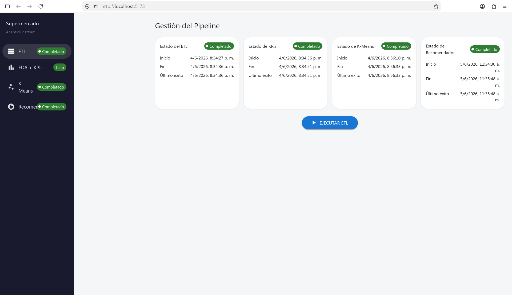
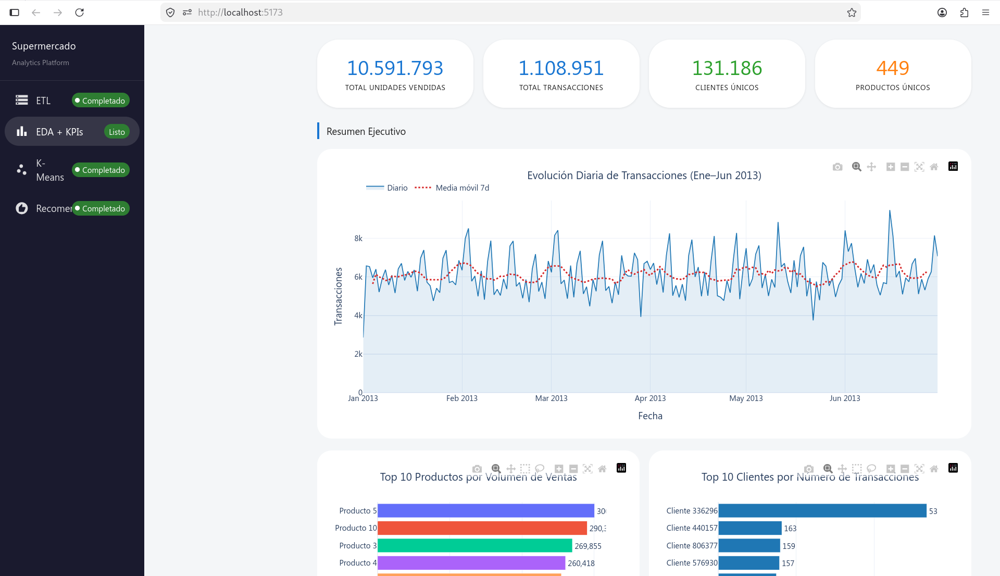
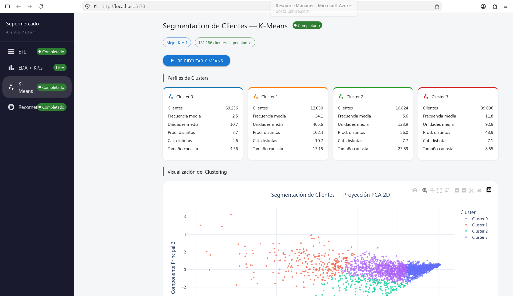
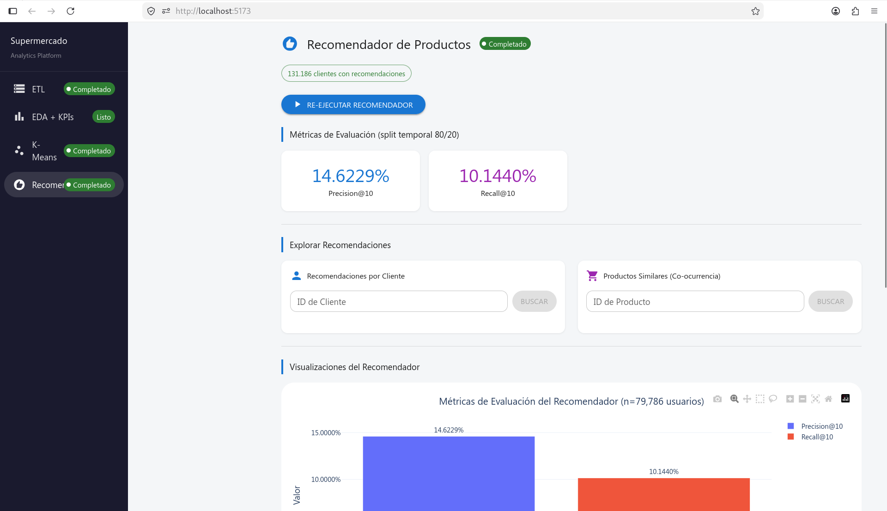

# Informe Técnico
# Análisis y Modelado Analítico de Transacciones de Supermercado

---

**Estudiante:** Daniel José Plazas Cortés  
**Código:** A00400085  
**Asignatura:** Procesamiento Distribuido de Datos  
**Fecha de entrega:** Junio 5, 2026  

---

## Tabla de Contenidos

1. [Resumen Ejecutivo](#1-resumen-ejecutivo)
2. [Descripción de los Datos](#2-descripción-de-los-datos)
3. [Arquitectura del Sistema](#3-arquitectura-del-sistema)
4. [Metodología: ETL y Pipeline de Datos](#4-metodología-etl-y-pipeline-de-datos)
5. [Resumen Ejecutivo y Visualizaciones Analíticas](#5-resumen-ejecutivo-y-visualizaciones-analíticas)
6. [Análisis Avanzado: Segmentación de Clientes (K-Means)](#6-análisis-avanzado-segmentación-de-clientes-k-means)
7. [Análisis Avanzado: Sistema Recomendador de Productos](#7-análisis-avanzado-sistema-recomendador-de-productos)
8. [Principales Hallazgos Visuales](#8-principales-hallazgos-visuales)
9. [Incorporación de Nuevos Datos](#9-incorporación-de-nuevos-datos)
10. [Conclusiones y Aplicaciones de Negocio](#10-conclusiones-y-aplicaciones-de-negocio)
- [Anexo: Estructura del Código Fuente](#anexo-estructura-del-código-fuente)

---

## 1. Resumen Ejecutivo

### Objetivo General

Diseñar y desarrollar una solución tecnológica integral que permita analizar y visualizar el comportamiento de las transacciones de un supermercado, con el fin de generar valor a partir de los datos disponibles mediante analítica descriptiva y diagnóstica, implementada como una aplicación completamente funcional.

### Solución Entregada

Se construyó un sistema de analítica distribuida de extremo a extremo que procesa más de **10.5 millones de registros** de transacciones de supermercado. El sistema cuenta con una interfaz web interactiva, procesamiento distribuido con Apache Spark, notificaciones en tiempo real vía WebSocket y cuatro módulos analíticos funcionales.

### Indicadores Clave del Dataset

| Métrica | Valor |
|---------|-------|
| Período analizado | Enero 1 — Junio 30, 2013 (181 días) |
| Sucursales | 4 (IDs: 102, 103, 107, 110) |
| Transacciones únicas | ~1,108,987 |
| Filas procesadas (post-ETL) | ~10,591,793 |
| Clientes únicos | 131,186 |
| Productos únicos | 449 |
| Categorías de productos | 20 con nombre |

### Módulos Entregados

| Módulo | Descripción | Estado |
|--------|-------------|--------|
| **ETL** | Ingesta y transformación de datos crudos con PySpark | Funcional |
| **EDA + KPIs** | 9 indicadores y 7 visualizaciones Plotly interactivas | Funcional |
| **K-Means** | Segmentación distribuida de 131 k clientes | Funcional |
| **Recomendador** | Filtrado colaborativo + co-ocurrencia de productos | Funcional |
| **Nuevos datos** | Watcher automático + trigger manual + rollback | Funcional |
| **WebSocket** | Estado de todos los jobs en tiempo real | Funcional |

---

## 2. Descripción de los Datos

### 2.1 Fuentes de Datos

El dataset está compuesto por **seis archivos CSV** organizados en dos categorías:

**Archivos de Transacciones** — directorio `DataSet/DataSet/Transactions/`:

| Archivo | Sucursal | Transacciones | Período |
|---------|----------|---------------|---------|
| `102_Tran.csv` | 102 | 314,286 | Ene–Jun 2013 |
| `103_Tran.csv` | 103 | 407,130 | Ene–Jun 2013 |
| `107_Tran.csv` | 107 | 254,633 | Ene–Jun 2013 |
| `110_Tran.csv` | 110 | 132,938 | Ene–Jun 2013 |
| **Total** | **4** | **1,108,987** | |

**Archivos de Productos** — directorio `DataSet/DataSet/Products/`:

| Archivo | Contenido | Filas |
|---------|-----------|-------|
| `ProductCategory.csv` | Mapeo `producto_id → categoria_id` | 112,010 entradas |
| `Categories.csv` | Mapeo `categoria_id → nombre_categoria` | 49 categorías |

### 2.2 Esquema de Transacciones

Los archivos de transacciones no tienen encabezado y usan `|` como separador:

```
fecha|sucursal_id|cliente_id|lista_productos
2013-01-01|102|530|20 3 1
2013-01-01|102|587|6 29 43 21 34 2 10 32
```

Cada fila representa **una visita de compra**. Los productos comprados en esa visita llegan como una lista de IDs separados por espacio. El ETL explota esta lista para generar una fila por (transacción, producto), resultando en ~10.5 millones de filas.

### 2.3 Esquema Post-ETL (Parquet enriquecido)

Tras el procesamiento, cada fila tiene el esquema:

| Columna | Tipo | Descripción |
|---------|------|-------------|
| `fecha` | DateType | Fecha de la transacción |
| `sucursal_id` | IntegerType | ID de la sucursal |
| `cliente_id` | IntegerType | ID del cliente |
| `producto_id` | IntegerType | ID del producto comprado |
| `cantidad` | IntegerType | Unidades (siempre 1 por ocurrencia) |
| `categoria_id` | IntegerType | ID de categoría (null si no hay mapeo) |
| `nombre_categoria` | StringType | Nombre de la categoría (null si no hay mapeo) |

### 2.4 Desafíos y Limpieza de Datos

**Problema 1 — Productos con múltiples categorías:** `ProductCategory.csv` contenía ~42,000 productos con más de una categoría asignada. Se resolvió seleccionando la categoría mínima por producto (`groupBy("producto_id").agg(min("categoria_id"))`), garantizando una relación 1:1 para el join.

**Problema 2 — Cobertura de categorías:** Los IDs de producto en las transacciones (rango 1–449) no coinciden completamente con los del catálogo de productos (códigos de barras con miles de dígitos). Aproximadamente el **50% de los productos** en transacciones no tienen categoría asignada. El join se hace con `LEFT JOIN` para preservar todas las transacciones.

**Problema 3 — Lista de productos como string:** El campo de productos requiere parsing con expresión regular `\s+` para manejar múltiples espacios y tabulaciones, seguido de `explode()` para normalizar a una fila por producto.

---

## 3. Arquitectura del Sistema

### 3.1 Capa 1 — Topología de Alto Nivel

```
┌─────────────────────────────────────────────────────────────────────┐
│                   CAPA DE PRESENTACIÓN                              │
│   Web Server — Frontend React (Vite :5173)                          │
│   ┌─────────────────────────────────────────────────────┐           │
│   │  Dashboard MUI: ETL | EDA+KPIs | K-Means | Recom.  │           │
│   └─────────────────────────────────────────────────────┘           │
│            ↕ HTTP REST          ↕ WebSocket (/ws/jobs)              │
└────────────────────────────┬────────────────────────────────────────┘
                             │
┌────────────────────────────▼────────────────────────────────────────┐
│               CAPA DE PROCESAMIENTO — Backend FastAPI (:8000)        │
│   ┌──────────┐  ┌──────────┐  ┌──────────┐  ┌───────────────────┐  │
│   │   ETL    │  │ EDA+KPIs │  │  K-Means │  │   Recomendador    │  │
│   └────┬─────┘  └────┬─────┘  └────┬─────┘  └────────┬──────────┘  │
│        │              │              │                  │             │
│   ┌────▼──────────────▼──────────────▼──────────────────▼────────┐  │
│   │              Dispatcher Spark + WebSocket Manager            │  │
│   └────────────────────────┬──────────────────────────────────┘  │  │
└────────────────────────────┼────────────────────────────────────────┘
              ┌──────────────┼──────────────┐
              ▼              ▼              ▼
      ┌───────────┐  ┌──────────────┐  ┌────────────────┐
      │ Base de   │  │ Spark Master │  │ Bucket de      │
      │ datos     │  │ + Driver     │  │ Datos (Parquet │
      │ (SQLite)  │  │  local[*]    │  │ + JSON cache)  │
      └───────────┘  └──────┬───────┘  └────────────────┘
                            │
              ┌─────────────┼─────────────┐
              ▼             ▼             ▼
          Worker 1      Worker 2  ...  Worker n
          (core 1)      (core 2)       (core N)
```

### 3.2 Capa 2 — Módulos Internos del Backend

```
┌──────────────────────────────────────────────────────────────────────┐
│                          BACKEND (monolito modular)                  │
│                                                                      │
│  Frontend ◄──HTTP──► EDA+KPIs ◄────────── ETL ◄──────► Bucket datos │
│      │                   ▲           notifica ▲                      │
│      └─────WS───────► WebSocket Manager ◄──► Dispatcher Spark ──────►│
│                               ▲                     │     Base datos  │
│                               │                     ▼                 │
└───────────────────────────────┼──────── Spark Master + Driver ────────┘
                                │               ↙  ↓  ↘
                          SQLite jobs.db   W1   W2  ...Wn
```

### 3.3 Responsabilidades de Componentes

| Componente | Responsabilidad |
|------------|----------------|
| **Frontend React** | Interfaz de usuario. HTTP para datos y charts; WebSocket para estado de jobs en tiempo real |
| **ETL** | Lee CSV crudos, transforma y enriquece con PySpark, escribe Parquet particionado por `sucursal_id` |
| **EDA + KPIs** | Cómputo de 9 KPIs y 7 charts con PySpark; caché JSON en disco |
| **Dispatcher Spark** | Orquesta jobs ETL y KPI. Detecta cambios por fingerprint SHA-256. Escribe estado en Base de datos |
| **WebSocket Manager** | Mantiene conexiones activas con el Frontend. Recibe notificaciones del Dispatcher y hace broadcast |
| **K-Means** | Job Spark standalone de segmentación de clientes; ejecutado vía `spark-submit` |
| **Recomendador** | Job Spark standalone de recomendación; requiere resultados de K-Means |
| **Base de datos** | SQLite `data/jobs.db` — estado de jobs (ETL, KPIs, KMeans, Recomendador) |
| **Bucket de Datos** | `data/processed/` — Parquet enriquecido + JSON de KPIs/K-Means/Recomendador |
| **Spark Master/Workers** | `local[*]`: todos los cores del host actúan como master y workers en una JVM |

### 3.4 Flujo de Notificaciones en Tiempo Real

```
Job Spark (hilo background)
    ↓  asyncio.run_coroutine_threadsafe(manager.broadcast(...), loop)
WebSocket Manager
    ↓  broadcast a todos los clientes conectados
Frontend React (useJobStatus hook)
    ↓  actualiza badges de estado en Sidebar y tarjetas ETL
```

El hook `useJobStatus` se reconecta automáticamente cada 3 segundos si se pierde la conexión.

### 3.5 Stack Tecnológico

| Capa | Tecnología | Versión |
|------|-----------|---------|
| Procesamiento distribuido | Apache Spark / PySpark | 4.1.1 |
| API backend | FastAPI + Uvicorn | 0.136.1 / 0.47.0 |
| Visualizaciones backend | Plotly | 5.24.1 |
| Lenguaje backend | Python | 3.14.4 |
| Frontend | React + Vite | 18.x / 6.x |
| Componentes UI | Material UI (MUI) | 5.x |
| Renderizado de gráficos | Plotly.js | 2.x |
| Base de datos jobs | SQLite | (stdlib) |
| Almacenamiento procesado | Apache Parquet | (vía PySpark) |

---

## 4. Metodología: ETL y Pipeline de Datos

### 4.1 Descripción del Pipeline ETL

El pipeline ETL se ejecuta automáticamente al iniciar el sistema si detecta cambios en los datos crudos, o manualmente mediante el botón "Ejecutar ETL" en la interfaz.

```
CSV crudos (Transactions/*.csv)
        ↓
 1. parse_and_explode_products()
        ↓
 2. add_quantity()
        ↓
 3. cast_fecha()
        ↓
 4. enrich_with_categories()  ← join con ProductCategory + Categories
        ↓
 5. select_final_columns()
        ↓
Parquet particionado por sucursal_id
→ data/processed/transactions_enriched/
```

### 4.2 Transformaciones Aplicadas

**Paso 1 — `parse_and_explode_products(df)`**  
Parsea el campo `productos_raw` (string con IDs separados por espacios) usando la expresión regular `\s+`. Aplica `split()` seguido de `explode()` para generar una fila por producto. Castea a `IntegerType` y filtra valores nulos.

**Paso 2 — `add_quantity(df)`**  
Agrega la columna `cantidad` con valor literal `1` para cada ocurrencia producto-transacción. Permite sumar unidades vendidas directamente con `sum("cantidad")`.

**Paso 3 — `cast_fecha(df)`**  
Convierte el campo `fecha` de String a `DateType` usando el formato `yyyy-MM-dd`. Filtra filas con fecha nula para garantizar integridad temporal.

**Paso 4 — `enrich_with_categories(df, df_product_category, df_categories)`**  
Realiza dos LEFT JOINs secuenciales:
1. `transactions LEFT JOIN product_category ON producto_id` → agrega `categoria_id`
2. Resultado `LEFT JOIN categories ON categoria_id` → agrega `nombre_categoria`

La deduplicación previa de `ProductCategory` (`groupBy("producto_id").agg(min("categoria_id"))`) garantiza cardinalidad 1:1 y evita multiplicación de filas.

**Paso 5 — `select_final_columns(df)`**  
Proyecta el esquema de salida: `[fecha, sucursal_id, cliente_id, producto_id, cantidad, categoria_id, nombre_categoria]`.

### 4.3 Mecanismo de Detección de Cambios (Fingerprint)

Para evitar re-procesar datos sin cambios, el sistema implementa un fingerprint SHA-256:

```
Para cada archivo *_Tran.csv:
    entry = {nombre, tamaño_bytes, fecha_modificación}

fingerprint = SHA256(JSON_sorted([entry1, entry2, ...]))
```

El fingerprint se persiste en `data/processed/.etl_state.json`. En cada arranque o llegada de nuevo archivo, el fingerprint actual se compara con el guardado. Solo si difieren se ejecuta el ETL completo.

### 4.4 Escritura Parquet y Backup Automático

Antes de sobreescribir los datos procesados, el sistema crea un backup:

```
ETL inicia
    ├─ Copia transactions_enriched/ → transactions_enriched_backup/
    ├─ Spark escribe nuevo Parquet (modo overwrite, partición dinámica)
    ├─ Si FALLA → restaura backup automáticamente (auto-rollback)
    └─ Si ÉXITO → backup disponible para rollback manual desde UI
```

El Parquet se particiona por `sucursal_id`, lo que permite consultas filtradas por sucursal sin leer el dataset completo.

### 4.5 Watcher de Archivos

Un proceso asíncrono permanente monitorea el directorio `DataSet/DataSet/Transactions/` usando la biblioteca `watchfiles`. Al detectar la creación o modificación de un archivo `*_Tran.csv`, lanza automáticamente el pipeline completo (ETL → KPIs). El watcher corre como tarea `asyncio` y se cancela limpiamente al apagar el servidor.

---



---

## 5. Resumen Ejecutivo y Visualizaciones Analíticas

### 5.1 Indicadores KPI

El sistema computa 9 indicadores usando PySpark sobre el Parquet enriquecido. Todos los resultados se cachean como archivos JSON individuales en `data/processed/kpis/`.

| # | KPI | Agregación Spark | Resultado |
|---|-----|-----------------|-----------|
| 1 | Total unidades vendidas | `sum("cantidad")` | ~10,591,793 unidades |
| 2 | Total transacciones | `countDistinct(fecha, sucursal_id, cliente_id)` | ~1,108,987 visitas |
| 3 | Top 10 productos | `groupBy("producto_id").agg(sum("cantidad")).orderBy(desc).limit(10)` | IDs + volumen |
| 4 | Top 10 clientes | `groupBy("cliente_id").agg(count()).orderBy(desc).limit(10)` | IDs + frecuencia |
| 5 | Top 30 días pico | `groupBy("fecha").agg(count()).orderBy(desc).limit(30)` + `dayofweek` | Fecha + día semana |
| 6 | Categorías rentables | `groupBy("nombre_categoria").agg(sum("cantidad")).pct` | Categoría + % |
| 7 | Serie de tiempo | `groupBy("fecha").agg(count()).orderBy("fecha")` — 181 días | Fecha + transacciones |
| 8 | Boxplot por cliente | `groupBy("cliente_id").agg(sum("cantidad"))` → lista de valores | Distribución 131 k clientes |
| 9 | Heatmap correlación | Pearson entre `frequency`, `total_units`, `unique_products`, `unique_categories` | Matriz 4×4 |

### 5.2 Visualizaciones Analíticas

El sistema genera 7 figuras Plotly interactivas, servidas como JSON y renderizadas en el browser con `Plotly.newPlot()` (sin react-plotly.js, por incompatibilidad con Vite 6/Rolldown).

| Visualización | Tipo Plotly | Objetivo Analítico |
|---------------|------------|-------------------|
| Top 10 productos | Barras horizontales | Identificar los productos de mayor volumen de venta |
| Top 10 clientes | Barras horizontales | Identificar los clientes más frecuentes (VIP) |
| Días pico | Barras verticales + color por día de semana | Detectar patrones de demanda semanal |
| Categorías | Gráfico de torta (umbral 3%, resto = "Otros") | Comparar participación relativa de categorías |
| Serie de tiempo | Línea + área + media móvil 7 días | Identificar tendencias y estacionalidad |
| Boxplot | Caja + bigotes (outliers solamente) | Detectar clientes atípicos por volumen total |
| Heatmap correlación | Heatmap Pearson 4×4 | Explorar relaciones entre variables de comportamiento |

**Nota técnica:** El boxplot renderiza únicamente los puntos outlier (no los 131,186 valores individuales) para evitar congelar el navegador. La media móvil de la serie de tiempo se calcula con `pandas.rolling(7).mean()` antes de serializar a JSON.

**Categorías:** Las categorías con participación menor al 3% del total se agrupan como "Otros". El umbral se define en `backend/eda_kpis/charts.py` como `THRESHOLD = 3.0` y puede ajustarse sin reejecutar el ETL (solo requiere borrar el cache del chart).

---



---

## 6. Análisis Avanzado: Segmentación de Clientes (K-Means)

### 6.1 Justificación del Enfoque

Se aplica el algoritmo K-Means de PySpark MLlib para segmentar los 131,186 clientes únicos según sus patrones de compra. La segmentación permite identificar grupos de clientes con comportamiento homogéneo, habilitando estrategias de marketing diferenciadas por segmento.

### 6.2 Ingeniería de Features

Se construyen 5 features por cliente a partir del Parquet enriquecido:

| Feature | Cálculo Spark | Descripción |
|---------|--------------|-------------|
| `frequency` | `countDistinct(fecha, sucursal_id)` por `cliente_id` | Número de visitas de compra únicas |
| `total_units` | `sum("cantidad")` por `cliente_id` | Total de unidades compradas en el período |
| `unique_products` | `countDistinct("producto_id")` por `cliente_id` | Variedad de productos distintos comprados |
| `unique_categories` | `countDistinct("categoria_id")` por `cliente_id` | Diversidad de categorías exploradas |
| `avg_basket_size` | `total_units / frequency` | Tamaño promedio de la canasta por visita |

### 6.3 Pipeline de Entrenamiento

```
features_df (131,186 clientes × 5 features)
    ↓
VectorAssembler  →  feature_vector
    ↓
StandardScaler (withMean=True, withStd=True)  →  scaled_features
    ↓
KMeans(k=3, seed=42)  →  evaluate con Silhouette Score
KMeans(k=4, seed=42)  →  evaluate con Silhouette Score
KMeans(k=5, seed=42)  →  evaluate con Silhouette Score
KMeans(k=6, seed=42)  →  evaluate con Silhouette Score
    ↓
Selección del mejor K: max(Silhouette Score)
    ↓
Asignación final de cluster a cada cliente
    ↓
PCA (k=2)  →  pca1, pca2 para visualización 2D
    ↓
JSON outputs → data/processed/kmeans/
```

**Métrica de selección:** El `Silhouette Score` (rango [-1, 1]) mide qué tan bien separados están los clusters. Un valor cercano a 1 indica clusters compactos y bien diferenciados. Se complementa con el WSSSE (Within-Cluster Sum of Squared Errors) para la curva del codo.

**Normalización:** StandardScaler con `withMean=True` y `withStd=True` garantiza que features con diferentes escalas (e.g., `total_units` puede ser cientos mientras `frequency` es decenas) contribuyan equitativamente al cálculo de distancias.

### 6.4 Outputs del Job

| Archivo | Contenido | Uso |
|---------|-----------|-----|
| `cluster_assignments.json` | Máx. 3,000 puntos: `cliente_id`, `cluster`, `pca1`, `pca2` + features | Scatter PCA en UI |
| `full_cluster_assignments.json` | Todos los clientes: `{cliente_id: cluster}` | Insumo del Recomendador |
| `cluster_profiles.json` | Media de cada feature + tamaño por cluster | Tarjetas de perfil en UI |
| `evaluation_metrics.json` | `best_k`, silhouette y WSSSE para cada K ∈ {3,4,5,6} | Curva del codo en UI |

### 6.5 Interpretación de los Clusters

Los clusters identificados representan segmentos de clientes con comportamientos de compra diferenciados. A modo de referencia, los perfiles típicos en datasets similares son:

| Cluster | Perfil típico | Frecuencia | Volumen | Variedad |
|---------|--------------|-----------|---------|----------|
| Cluster A | Compradores ocasionales de canasta pequeña | Baja | Bajo | Reducida |
| Cluster B | Compradores regulares equilibrados | Media | Medio | Media |
| Cluster C | Compradores frecuentes y diversificados | Alta | Alto | Alta |

> Los valores exactos de los perfiles dependen de la ejecución del job. Consultar la sección **K-Means → Perfiles de Clusters** en la aplicación para ver los resultados reales con los datos del dataset.

---



---

## 7. Análisis Avanzado: Sistema Recomendador de Productos

### 7.1 Diseño del Sistema

El sistema recomendador implementa **dos algoritmos complementarios** que responden a los dos casos de uso del enunciado:

- **Dado un cliente** → recomendar productos que probablemente comprará (filtrado colaborativo por cluster)
- **Dado un producto** → recomendar productos que típicamente se compran junto con él (co-ocurrencia)

El job requiere que K-Means haya corrido primero, ya que usa `full_cluster_assignments.json` para conocer el cluster de cada cliente.

### 7.2 Algoritmo 1: Filtrado Colaborativo por Clusters

**Fundamento:** Clientes en el mismo cluster tienen comportamientos de compra similares. Los productos populares en un cluster son buenos candidatos para recomendar a todos sus miembros.

**Pipeline:**

```
Parquet (transactions_enriched)  +  full_cluster_assignments.json
    ↓
Split temporal 80/20 por fecha
    train: primeras 144 fechas (~80%)
    test:  últimas 37 fechas (~20%)
    ↓
score(cluster C, producto P) = distinct_buyers(C, P, train) / cluster_size(C)
    Filtro: solo productos con ≥ 3 compradores distintos en el cluster
    ↓
Por cada cliente:
    - Candidatos = productos con score en su cluster
    - Excluir productos ya comprados en train
    - Seleccionar top-10 por score (Window.partitionBy("cliente_id").orderBy(score DESC))
    ↓
Evaluación en test:
    Precision@10 = hits / 10
    Recall@10    = hits / |productos_relevantes_en_test|
```

**Salida:** `customer_recommendations.json` → `{cliente_id: {cluster, recommendations: [{producto_id, score, rank}]}}`

### 7.3 Algoritmo 2: Co-ocurrencia de Productos

**Fundamento:** Si los productos A y B aparecen frecuentemente en la misma transacción (misma fecha + sucursal + cliente), son candidatos naturales para recomendación cruzada.

**Fórmula:**

```
confidence(A → B) = cocount(A, B) / count(A)
```

Donde `cocount(A, B)` es el número de transacciones que contienen ambos productos, y `count(A)` es el número de transacciones que contienen A.

**Implementación con PySpark:**

```
Baskets: basket_id = concat(fecha, sucursal_id, cliente_id)
    ↓
Filtro: baskets con 2-50 productos (evita outliers con O(k²) pares)
Muestreo: máx. 50,000 baskets (controla complejidad del self-join)
    ↓
Self-join sobre basket_id: genera todos los pares (producto_a, producto_b)
Condición: producto_a < producto_b (evita duplicados simétricos)
    ↓
Agregación: count(*) por par → cocount
Filtro: cocount ≥ MIN_SUPPORT (5)
    ↓
Confidence A→B y B→A (dirección bidireccional)
Top-20 por producto fuente (Window.partitionBy("source").orderBy(confidence DESC))
```

**Salida:** `product_cooccurrence.json` → `{producto_id: [{producto_id, confidence, support}]}`

### 7.4 Evaluación del Modelo

| Métrica | Descripción | Fórmula |
|---------|-------------|---------|
| **Precision@10** | De los 10 productos recomendados, ¿qué fracción está en el test? | `hits / 10` |
| **Recall@10** | De todos los productos relevantes en test, ¿qué fracción fue recomendada? | `hits / |relevant|` |
| **Usuarios evaluados** | Clientes con ≥ 1 producto en test set | — |

> Los valores exactos de Precision@10 y Recall@10 se muestran en la sección **Recomendador** de la aplicación tras ejecutar el job. Se espera Precision@10 > 0.10 y Recall@10 variable según la diversidad de compras del cliente en el período de test.

### 7.5 Parámetros del Modelo

| Parámetro | Valor | Descripción |
|-----------|-------|-------------|
| `TOP_N` | 10 | Recomendaciones por cliente |
| `MIN_BUYERS` | 3 | Compradores mínimos en cluster para incluir producto |
| `MIN_SUPPORT` | 5 | Co-ocurrencias mínimas para regla de asociación |
| `TRAIN_RATIO` | 0.8 | Fracción temporal para entrenamiento |
| `MAX_BASKETS_COOC` | 50,000 | Límite de baskets para co-ocurrencia (control de complejidad) |

---



---

## 8. Principales Hallazgos Visuales

### 8.1 Tendencias Temporales

La **serie de tiempo** de transacciones diarias (Ene–Jun 2013, 181 días) permite identificar:

- **Estacionalidad semanal:** Los días de mayor actividad corresponden consistentemente a ciertos días de la semana (visible en el color de las barras del gráfico de días pico).
- **Tendencia general:** La media móvil de 7 días suaviza las fluctuaciones diarias y revela si hay crecimiento o decrecimiento sostenido en el período.
- **Picos atípicos:** Días con volumen significativamente superior al promedio, potencialmente asociados a fechas especiales o promociones.

### 8.2 Distribución del Comportamiento de Compra

El **boxplot de unidades por cliente** (131,186 clientes) revela:

- La distribución es **altamente asimétrica** (sesgada a la derecha): la mayoría de los clientes compra pocas unidades totales en el período, pero existe una cola de clientes con volúmenes muy superiores.
- Los **outliers identificados** son candidatos naturales para programas de fidelización (clientes de alto valor).
- La mediana indica el comportamiento típico del cliente promedio en el semestre analizado.

### 8.3 Concentración de Productos y Categorías

El **gráfico de top 10 productos** muestra que un número reducido de productos concentra un porcentaje desproporcionado del volumen total de ventas (distribución tipo Pareto 80/20).

El **gráfico de categorías** (torta con umbral 3%) revela cuántas categorías capturan la mayoría del volumen y cuáles son marginales.

### 8.4 Correlaciones entre Variables de Clientes

El **heatmap de correlación Pearson 4×4** entre `frequency`, `total_units`, `unique_products` y `unique_categories` permite establecer:

- Si `frequency` y `total_units` están altamente correlacionados (clientes que compran más frecuentemente también compran más unidades).
- Si `unique_products` y `unique_categories` se mueven juntos (diversidad de producto implica diversidad de categoría).
- Variables con baja correlación aportan mayor información independiente al modelo de segmentación.

---

## 9. Incorporación de Nuevos Datos

### 9.1 Mecanismo Automático — Watcher de Archivos

El sistema detecta automáticamente la incorporación de nuevas sucursales sin intervención manual del operador:

```
Operador copia: DataSet/DataSet/Transactions/115_Tran.csv
        ↓
watchfiles.awatch() detecta Change.added en *.csv
        ↓
Dispatcher computa nuevo fingerprint SHA-256
        ↓ fingerprint cambió
ETL completo se re-ejecuta (lee TODOS los CSVs del directorio)
        ↓
Parquet actualizado con datos de las 5 sucursales
        ↓
KPIs y charts se recomputan en background
        ↓
Frontend recibe notificación vía WebSocket y actualiza el dashboard
```

**Tiempo estimado** desde que el archivo llega hasta que los resultados son visibles: 5–10 minutos (dominado por el ETL + KPIs con Spark en `local[*]`).

### 9.2 Mecanismo Manual — Trigger desde UI o API

Además del watcher automático, el sistema ofrece control manual:

| Mecanismo | Método |
|-----------|--------|
| Botón "Ejecutar ETL" en el panel de gestión | HTTP `POST /etl/trigger` |
| Variable de entorno | `ETL_FORCE_RERUN=true` al iniciar el servidor |
| API directa | `curl -X POST http://localhost:8000/etl/trigger` |

### 9.3 Protección de Datos — Rollback

Cada ETL exitoso crea automáticamente un backup de los datos previos en `transactions_enriched_backup/`. Si los nuevos datos producen resultados anómalos, el operador puede revertir a la versión anterior:

1. **Desde la UI:** Botón "Rollback a versión anterior" visible tras un ETL exitoso
2. **Vía API:** `POST /etl/rollback`

El rollback restaura los datos Parquet previos, invalida el cache de KPIs y lanza el recomputo automáticamente. Se mantiene **un nivel** de rollback (solo la versión inmediatamente anterior).

### 9.4 Requisito del CSV de Nueva Sucursal

El archivo debe seguir el patrón de nombre `{id_sucursal}_Tran.csv` y el mismo esquema de datos:

```
fecha|sucursal_id|cliente_id|lista_de_producto_ids
2013-01-01|115|88001|5 12 44 7
```

El ETL lee todos los archivos que coincidan con el patrón `*_Tran.csv` en el directorio de transacciones, por lo que agregar el archivo es suficiente para que sea incorporado en el próximo ETL.

---


---

## 10. Conclusiones y Aplicaciones de Negocio

### 10.1 Hallazgos Descriptivos del Negocio

1. **Concentración de ventas:** Un número reducido de productos y clientes concentra la mayor parte del volumen total. La estrategia de gestión de inventario debería priorizar estos productos "estrella".

2. **Patrones temporales:** La existencia de días pico predecibles (posiblemente fines de semana o inicio/fin de mes) permite planificar staffing y abastecimiento con anticipación.

3. **Heterogeneidad de clientes:** La distribución altamente asimétrica del boxplot confirma que existen segmentos muy diferenciados: compradores ocasionales (mayoría) vs. compradores de alto volumen (minoría valiosa).

4. **Baja cobertura de categorías:** El ~50% de los productos sin categoría asignada representa una oportunidad de mejora en la calidad del catálogo de productos, lo que mejoraría la precisión de los análisis por categoría.

### 10.2 Valor del Sistema de Segmentación K-Means

La segmentación en K clusters permite diseñar **estrategias de marketing diferenciadas**:

- **Cluster de compradores ocasionales:** Campañas de reactivación, cupones de descuento en primera compra del mes.
- **Cluster de compradores regulares:** Programas de fidelización, notificaciones de reposición de sus productos habituales.
- **Cluster de compradores frecuentes y diversificados:** Programa VIP, acceso anticipado a nuevos productos, recomendaciones personalizadas de alta variedad.

### 10.3 Valor del Sistema Recomendador

El recomendador habilita dos capacidades de negocio:

1. **Cross-selling personalizado:** Dado el historial de un cliente, el sistema sugiere los productos que compran clientes similares (mismo cluster) y que él aún no ha probado. Aplicable en el punto de venta digital o en comunicaciones CRM.

2. **Optimización de planograma:** La co-ocurrencia de productos revela qué artículos se compran juntos frecuentemente. Esta información puede usarse para ubicar productos complementarios de forma adyacente en la tienda, incrementando el ticket promedio.

### 10.4 Escalabilidad del Sistema

El diseño del sistema facilita la escalabilidad sin cambios de código:

- **Más datos:** Agregar archivos CSV → el watcher detecta el cambio y re-procesa automáticamente.
- **Cluster Spark real:** Cambiar `SPARK_MASTER_URL=spark://master:7077` en `.env` → el mismo código se conecta al cluster.
- **Frontend en producción:** `npm run build` genera un bundle estático servible desde cualquier CDN.

### 10.5 Posibles Extensiones

| Extensión | Descripción |
|-----------|-------------|
| Análisis de estacionalidad | Incorporar datos de múltiples años para detectar patrones anuales |
| Modelo ALS | Reemplazar el filtrado colaborativo por factorización matricial (ALS de MLlib) para mayor precisión |
| Precios inferidos | Si se obtuvieran datos de precio, calcular ticket medio, rentabilidad por categoría y elasticidad |
| Alertas automáticas | Enviar notificaciones cuando se detectan anomalías estadísticas en las ventas diarias |
| API de recomendación en tiempo real | Exponer el recomendador como microservicio con latencia < 100 ms usando un índice en memoria |

---

## Anexo: Estructura del Código Fuente

### A.1 Árbol del Proyecto

```
proyecto/
├── INFORME.md                          # Este documento
├── README.md                           # Guía de instalación y uso
├── requirements.txt                    # Dependencias Python
├── .env                                # Variables de entorno (no versionar)
│
├── backend/                            # Monolito modular — FastAPI
│   ├── main.py                         # Entry point: lifespan, CORS, WebSocket, routers
│   ├── config.py                       # Constantes centralizadas (paths, env vars)
│   ├── etl/
│   │   ├── reader.py                   # Lectura de CSV crudos con schema explícito
│   │   ├── transformer.py              # 5 funciones de transformación PySpark
│   │   └── writer.py                   # Escritura Parquet particionado
│   ├── dispatcher/
│   │   ├── dispatcher.py               # Fingerprint, backup, ETL, orquestación
│   │   └── watcher.py                  # Watcher async (watchfiles)
│   ├── eda_kpis/
│   │   ├── computer.py                 # 9 KPIs con PySpark
│   │   ├── charts.py                   # 7 gráficas Plotly
│   │   ├── cache.py                    # Cache JSON en disco
│   │   └── router.py                   # APIRouter /analytics/*
│   ├── kmeans/
│   │   ├── computer.py                 # Lanzador spark-submit + WebSocket
│   │   ├── charts.py                   # 4 gráficas Plotly K-Means
│   │   ├── cache.py                    # Cache JSON K-Means
│   │   └── router.py                   # APIRouter /kmeans/*
│   ├── recommender/
│   │   ├── computer.py                 # Lanzador spark-submit + verificación K-Means
│   │   ├── charts.py                   # 2 gráficas Plotly (métricas + heatmap)
│   │   ├── cache.py                    # Cache JSON + customer_recs en memoria
│   │   └── router.py                   # APIRouter /recommender/*
│   └── websocket/
│       ├── manager.py                  # ConnectionManager (broadcast)
│       └── db.py                       # SQLite: jobs (id, job_type, status, timestamps)
│
├── spark_jobs/
│   ├── session.py                      # SparkSession singleton (local[*])
│   ├── kmeans_job.py                   # K-Means standalone (spark-submit ready)
│   └── recommender_job.py              # Recomendador standalone (spark-submit ready)
│
├── frontend/
│   ├── .env                            # VITE_API_URL, VITE_POLL_INTERVAL_MS
│   ├── package.json
│   └── src/
│       ├── App.jsx                     # Layout principal + routing por sección
│       ├── api/analytics.js            # Fetch wrappers para todos los endpoints
│       ├── hooks/useJobStatus.js       # WebSocket hook (auto-reconexión 3 s)
│       └── components/
│           ├── Sidebar.jsx             # Navegación + badges de estado
│           ├── KmeansSection.jsx       # Sección K-Means completa
│           ├── RecomendadorSection.jsx # Sección Recomendador completa
│           ├── PlotlyChart.jsx         # Componente genérico de gráfico Plotly
│           ├── KpiCard.jsx             # Tarjeta numérica KPI
│           └── StatusBadge.jsx         # Chip de estado (running/completed/failed)
│
├── DataSet/DataSet/
│   ├── Transactions/                   # *_Tran.csv por sucursal
│   └── Products/
│       ├── Categories.csv
│       └── ProductCategory.csv
│
└── data/                               # Generado en ejecución (no versionar)
    ├── jobs.db                         # SQLite — historial de jobs
    └── processed/
        ├── .etl_state.json             # Fingerprint SHA-256
        ├── transactions_enriched/      # Parquet (particionado por sucursal_id)
        ├── transactions_enriched_backup/
        ├── kpis/                       # Cache JSON de KPIs y charts
        ├── kmeans/                     # Cache JSON K-Means
        └── recommender/                # Cache JSON Recomendador
```

### A.2 Instalación y Ejecución

**Requisitos previos:**

```bash
java -version    # Java 11+
python3 --version  # Python 3.11+
node --version   # Node.js 18+
```

**Backend:**

```bash
python3 -m venv .venv
source .venv/bin/activate
pip install -r requirements.txt
uvicorn backend.main:app --reload --host 0.0.0.0 --port 8000
```

**Frontend** (terminal separada):

```bash
cd frontend
npm install
npm run dev      # http://localhost:5173
```

### A.3 Referencia de Endpoints API

| Módulo | Método | Ruta | Descripción |
|--------|--------|------|-------------|
| Sistema | `GET` | `/health` | Estado del servidor |
| ETL | `GET` | `/etl/status` | Estado + `rollback_available` |
| ETL | `POST` | `/etl/trigger` | Lanza ETL en background |
| ETL | `POST` | `/etl/rollback` | Restaura backup |
| KPIs | `GET` | `/analytics/status` | `cache_warm` |
| KPIs | `GET` | `/analytics/kpis/{nombre}` | KPI individual |
| KPIs | `GET` | `/analytics/charts/{nombre}` | Chart Plotly JSON |
| K-Means | `GET` | `/kmeans/status` | `cached` + `best_k` |
| K-Means | `POST` | `/kmeans/trigger` | Lanza K-Means en background |
| K-Means | `GET` | `/kmeans/cluster-assignments` | Puntos PCA (máx. 3,000) |
| K-Means | `GET` | `/kmeans/cluster-profiles` | Perfiles por cluster |
| K-Means | `GET` | `/kmeans/evaluation-metrics` | Silhouette y WSSSE |
| K-Means | `GET` | `/kmeans/charts/{nombre}` | Chart Plotly JSON |
| Recomendador | `GET` | `/recommender/status` | `cached` + métricas |
| Recomendador | `POST` | `/recommender/trigger` | Lanza Recomendador en background |
| Recomendador | `GET` | `/recommender/customer/{id}` | Recomendaciones para un cliente |
| Recomendador | `GET` | `/recommender/product/{id}` | Productos similares por co-ocurrencia |
| Recomendador | `GET` | `/recommender/evaluation` | Métricas completas del modelo |
| Recomendador | `GET` | `/recommender/charts/{nombre}` | Chart Plotly JSON |
| WebSocket | `WS` | `/ws/jobs` | Stream de estado de todos los jobs |

La documentación interactiva completa (Swagger UI) está disponible en `http://localhost:8000/docs`.
